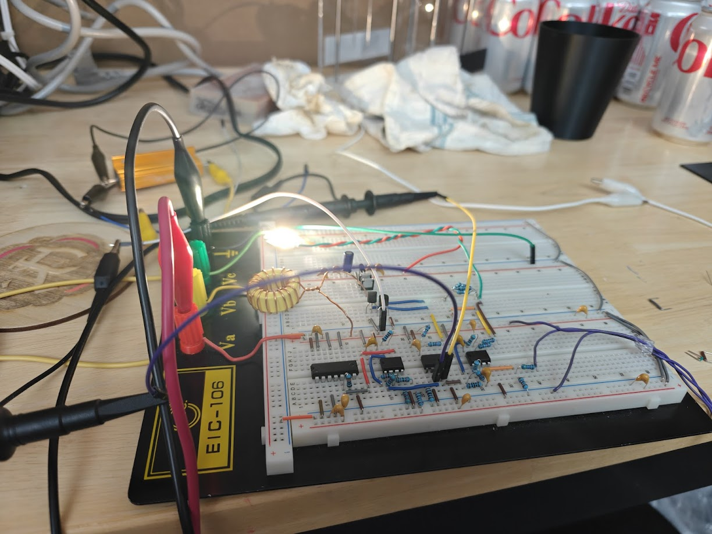
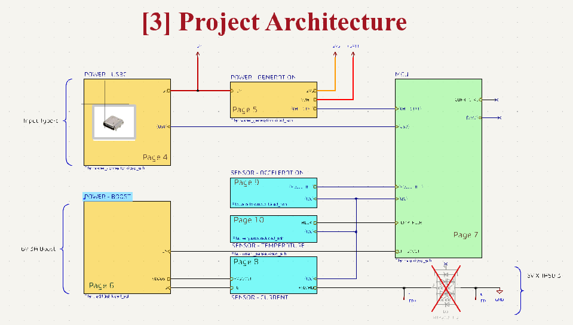
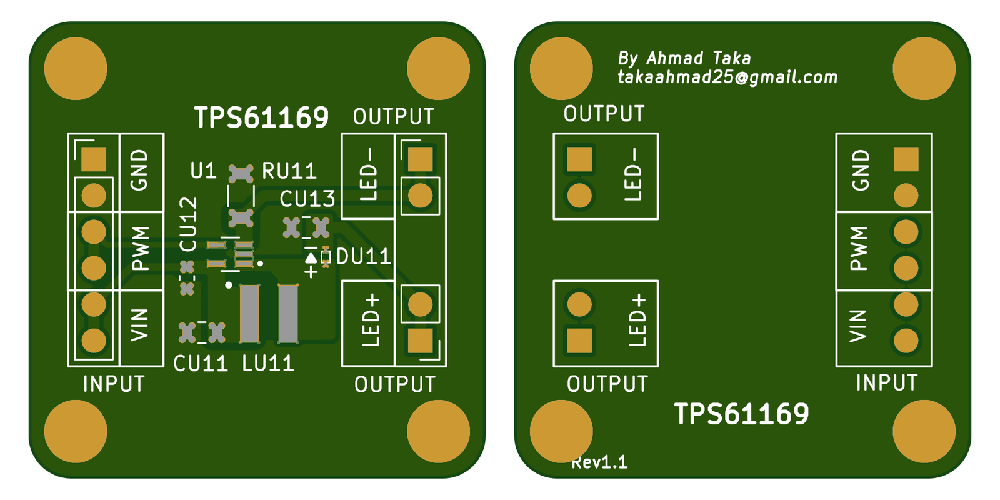
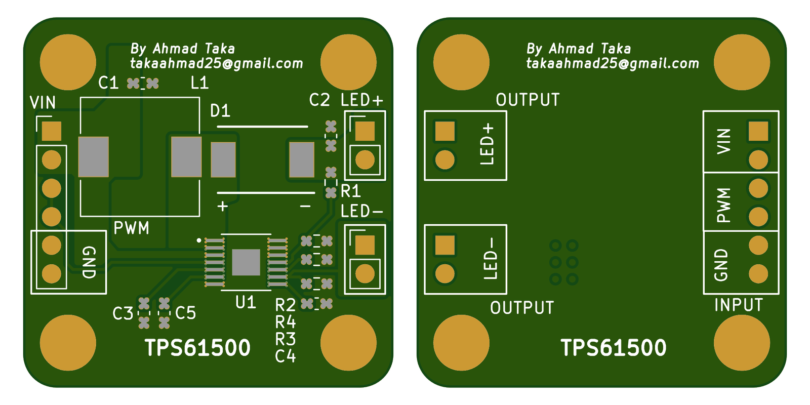
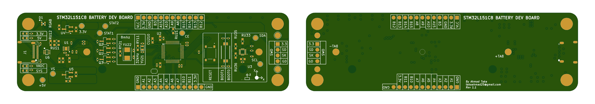
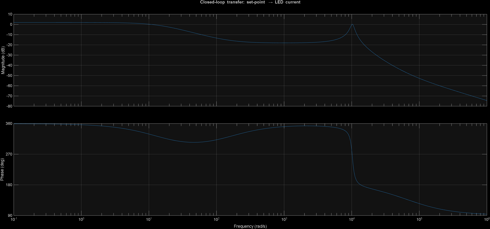
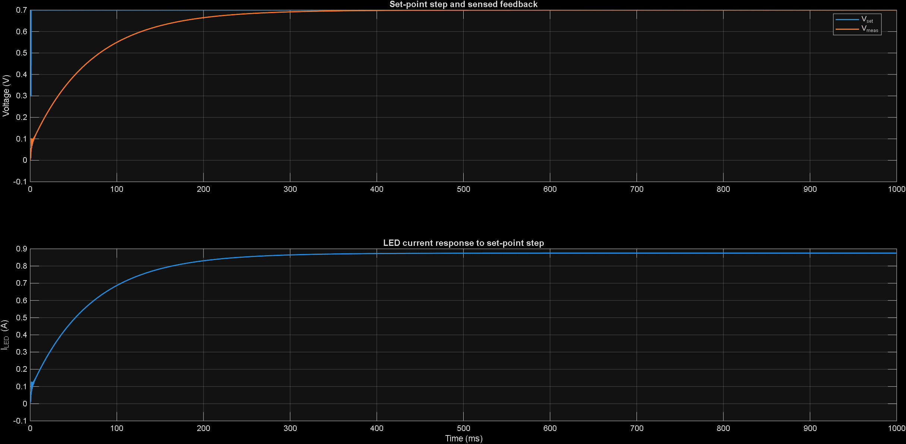
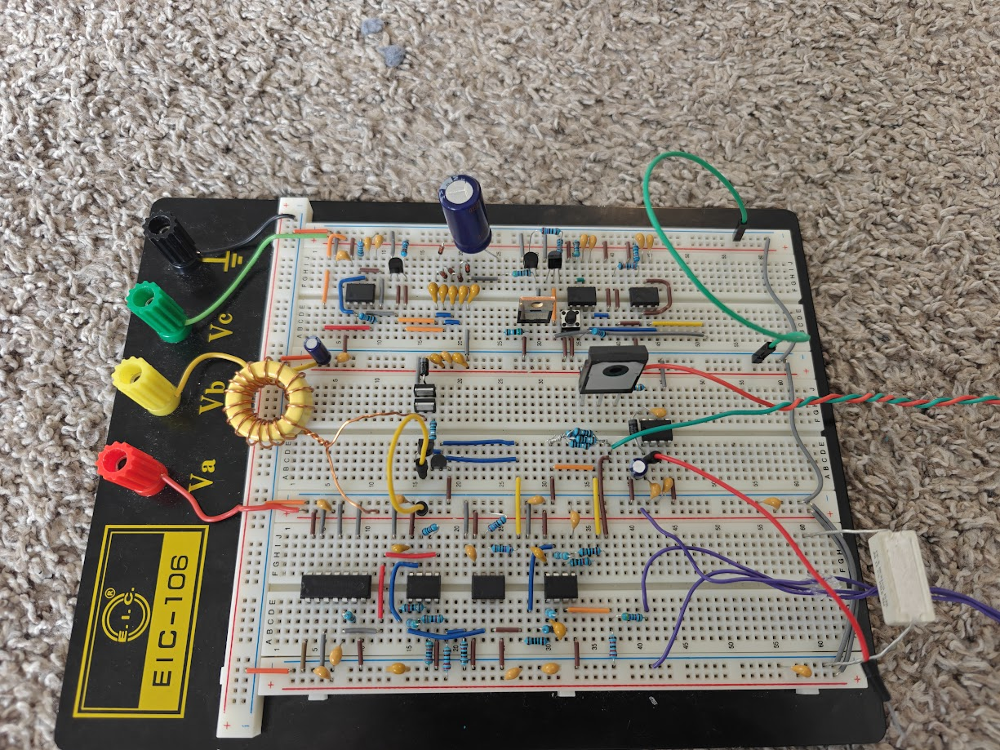
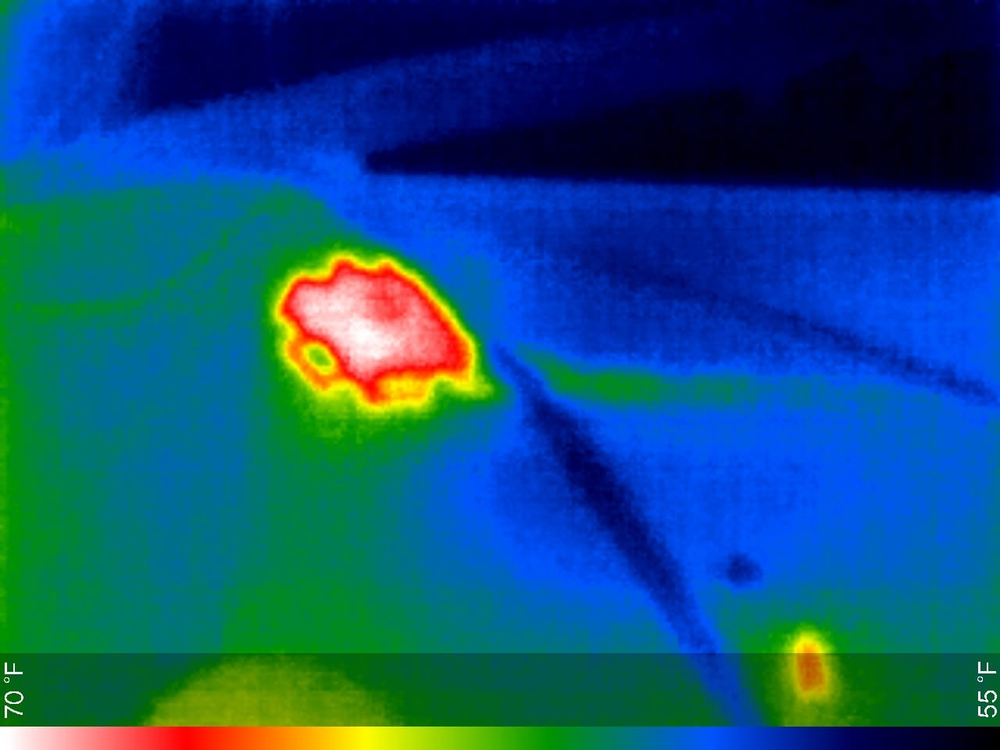

# Flashlight: high-power LED driver

A handheld flashlight built around a **Cree XHP50.3 (6 V)** LED. The repo holds two threads of work:

1. **The power converter** (finished, documented in the final report): a discrete, analog, constant-current **boost converter** that takes 3 V from two alkaline cells up to about 6–6.5 V and regulates the LED at about 1–1.5 A. It uses op-amps, a comparator and a gate driver, with no microcontroller in the loop. It was built as the final project for MIT 6.2222 (fall 2025), including the graduate extension.
2. **The product boards** (in progress): an STM32 controller with shake-to-wake, a USB-PD charger and power-path board, and an integrated v1.1 board meant to put everything on a single 21700-cell PCB.



📄 **Read the final report:** [`docs/reports/final_report/final_report.pdf`](docs/reports/final_report/final_report.pdf) (the Typst source is next to it). The original proposal is in [`docs/reports/proposal/`](docs/reports/proposal).

---

## Contents

- [Status](#status)
- [Repository layout](#repository-layout)
- [How the converter works](#how-the-converter-works)
- [Boards](#boards)
- [Firmware](#firmware)
- [Analysis](#analysis)
- [Mechanical](#mechanical)
- [Reproducing the design](#reproducing-the-design)
- [Results](#results)
- [Known issues and next steps](#known-issues-and-next-steps)

## Status

| Area | Status |
|---|---|
| Boost LED driver (report design) | ✅ Built and measured on the bench (1 A LED current, stable closed loop) |
| Dev boards (`boost-dev`, `boost-dev-2`, `stm32-dev`, `led`) | ✅ Routed, with JLCPCB fab and assembly files |
| USB-PD power-input board | 🟡 Routed (4 layers, KiCad 8/9, May 2026); fab outputs need regenerating (see [known issues](#known-issues-and-next-steps)) |
| Integrated board `flashlight-full-v1-1` | 🟡 Schematic only (14 sheets), not laid out |
| Firmware (STM32 shake-to-wake) | 🟡 Proof of concept (~100 lines) |
| Mechanical (body, head, optic) | 🟡 SolidWorks assembly, not yet built |

## Repository layout

```
flashlight_project/
├── docs/
│   └── reports/
│       ├── final_report/     Typst source + PDF + figures (6.2222 final report)
│       └── proposal/         project proposal (Typst + PDF)
├── electrical/               one KiCad project per board (see "Boards")
├── firmware/
│   └── flashlight-firmware-stm32/   PlatformIO project (STM32L151, Arduino core)
├── analysis/
│   └── sim/boost_transfer.m  MATLAB state-space model of the boost + PI loop
└── mechanical/
    └── cad/flashlight-v1.SLDASM     SolidWorks assembly (body, head, optic, cell)
```

See [docs/STRUCTURE.md](docs/STRUCTURE.md) for the folder conventions shared across my projects.

## How the converter works



**Power stage.** A non-synchronous boost converter: a 22 µH inductor, a low-side switch, a Schottky rectifier and a 120 µF output capacitor. The LED returns to ground through a 0.2 Ω shunt.

| Parameter | Value |
|---|---|
| Input | 3 V (2 × alkaline cells) |
| Output | ≈ 6–6.5 V at the LED, 1–1.5 A (2 A hard ceiling) |
| Switching frequency | ≈ 100 kHz |
| Duty cycle | D ≈ 0.52 |
| Average inductor current | ≈ 3.9 A (ripple ≈ 0.7 A) |
| Inductor sizing | L_min ≈ 18 µH at 20 % ripple, so 22 µH chosen |
| Shunt dissipation | 0.45–0.8 W at 1.5–2 A |

**Control loop.** This is voltage-mode PWM with an outer LED-current loop, all built from analog parts:

1. An **LM358** amplifies the shunt voltage (current sense).
2. A second **LM358** stage acts as a PI controller and outputs V_ctrl. The model maps it with R_in = 10 kΩ and R_f = 680 Ω.
3. A third **LM358** generates a 0–1 V, ~100 kHz triangle.
4. An **LM311** comparator compares V_ctrl with the triangle to produce PWM.
5. An **IR2125** high-current gate driver drives the switch; a 12 V gate supply is needed for the GaN part.

**Switch comparison.** The same power stage was run with a silicon MOSFET (**RFD3055LESM**, ~107 mΩ) and a GaN FET (**GAN041-650WSBQ**, ~41 mΩ). Estimated device loss at the operating point is ≈ 84 mW for Si versus ≈ 18 mW for GaN, and the GaN part ran visibly cooler.

**Graduate extension.** The report adds a switched-capacitor quadrupler that charges a storage capacitor for a "flash" pulse through a 1 Ω series resistor (see “Graduate Extension” in the report).

The report also covers loop-shaping with Black's feedback formula and the boost converter's right-half-plane zero. It compares voltage-mode and current-mode control, drawing on the TI application notes it cites.

## Boards

All boards are KiCad projects under `electrical/`. Board renders are generated from the committed Gerbers.

| Board | What it is | Key parts | PCB |
|---|---|---|---|
| [`flashlight-boost-dev`](electrical/flashlight-boost-dev) | First IC-based LED boost test board | TPS61169 boost LED driver, NSR0240 Schottky, 4.7 µH WE-MAPI | 2 layers, 32 × 32 mm, JLCPCB files |
| [`flashlight-boost-dev-2`](electrical/flashlight-boost-dev-2) | Higher-power IC boost test board | TPS61500, 10 µH CDRH105R, SS36 3 A Schottky | 2 layers, 33 × 33 mm, JLCPCB files |
| [`flashlight-stm32-dev`](electrical/flashlight-stm32-dev) | "STM32L151C8 Battery Dev Board": controller and charging bring-up | STM32L151C8, BQ25185 charger/power path, MMA8452Q accelerometer, 2 × MCP1703A LDO, USB-C, ST-LINK header, 2 × 12 GPIO headers, RGB LED, 8 MHz + 32.768 kHz crystals | 6 layers, 120 × 35 mm, 99 parts, JLCPCB files |
| [`flashlight-led`](electrical/flashlight-led) | Small round LED carrier board | 3 LEDs, +18 V input | 2 layers, JLCPCB files |
| [`flashlight-power-input-dev`](electrical/flashlight-power-input-dev) | "100 W Power Delivery + Charger Module" | CYPD3177 USB-PD sink, BQ25792 buck-boost charger, BQ297xx protector, 4 × CSD16406Q3, 2 × LM5050-1 ideal diodes, TPS61222, TLV733, 21700 cell | 4 layers, 100 × 30 mm, 97 parts |
| [`flashlight-full-v1-1`](electrical/flashlight-full-v1-1) | Integrated flashlight (schematic) | STM32F070F6P, TPS61088 boost, BQ25185, BQ27220 fuel gauge, MMA8452Q, TMP102, INA180A1, MCP4017 digipot, IR2125, LM358 × 3, LM311, 74HC14, 2 × XHP50.3, 21700 cell, USB-C | 6-layer stackup, 14 schematic sheets, not laid out |
| `flashlight-hardware` | Empty placeholder project | — | — |

The early plan used TI boost-LED ICs (the two `boost-dev` boards). They could not deliver the current the XHP50.3 needs, which is why the report design went discrete.

<details>
<summary>Board renders (top and bottom)</summary>

**flashlight-boost-dev** (TPS61169)


**flashlight-boost-dev-2** (TPS61500)


**flashlight-stm32-dev**


</details>

## Firmware

`firmware/flashlight-firmware-stm32` is a PlatformIO project for the STM32L151 dev board. It shows the shake-to-toggle behavior:

- It configures the MMA8452Q **transient (shake) detector** over I²C on PB7/PB6: X/Y axes, threshold 12 (≈ 0.75 g), 25 × 20 ms debounce.
- The accelerometer interrupt on **PA0** wakes the MCU from deep sleep through `STM32LowPower`, and each shake toggles the output on **PB9**.

| Setting | Value |
|---|---|
| Platform | `ststm32`, Arduino framework |
| Board definition | `rak811_tracker` (an STM32L151 board used as a stand-in), with a local `boards/` directory |
| Libraries | `sparkfun/SparkFun_MMA8452Q ^1.4.0`, `stm32duino/STM32duino Low Power ^1.4.0` |
| Upload | `serial`: the STM32 ROM UART bootloader (hold BOOT0 high and reset) |

```bash
cd firmware/flashlight-firmware-stm32
pio run                     # build
pio run -t upload           # flash over the UART bootloader
# or use the board's ST-LINK header: set upload_protocol = stlink in platformio.ini
```

## Analysis

`analysis/sim/boost_transfer.m` (MATLAB) builds the averaged small-signal model of the boost, including the RHP zero. It wraps the PI controller around that model as an augmented state-space system, then plots the loop Bode response and the closed-loop setpoint step. Run it in MATLAB with the Control System Toolbox. The listing is also in the report appendix.

| Loop gain | Step response |
|---|---|
|  |  |

## Mechanical

`mechanical/cad/flashlight-v1.SLDASM` (SolidWorks) contains the body, head, a TIR 60° optic, an 18650 cell model, a copper slug for the LED, and the LED PCB. Mounting holders for the dev boards are in `electrical/<board>/holder/` (SLDPRT and STEP).

## Reproducing the design

| What | Tool |
|---|---|
| Schematics and PCBs | KiCad 8 or newer. `flashlight-power-input-dev` was last saved in KiCad 9. Projects use `${KIPRJMOD}`-relative libraries in each board's `libs/` folder. |
| PCB fab and assembly | Each board has `jlcpcb/gerber/` and `jlcpcb/production_files/` (Gerber zip, BOM and CPL) for JLCPCB. |
| Report | [Typst](https://typst.app) (`typst compile final_report.typ`) |
| Model | MATLAB with the Control System Toolbox |
| Firmware | PlatformIO (VS Code extension or `pio` CLI) |
| CAD | SolidWorks |

**Rebuilding the report converter on a bench.** Component values and schematic blocks are in the report's “Circuit Design and Analysis” chapter, which covers the power stage, current sense and PI loop, magnetics, and switch choice. “Hardware Implementation and Measurement Setup” covers the bench setup.

Bring-up order, from the report:
1. Run the boost open-loop at a fixed duty cycle into a resistive load.
2. Close the current loop at a low setpoint.
3. Raise the setpoint to the LED operating point.

The two fixes that mattered were:
- an RC filter (100 Ω / 1 nF) on the current-sense signal, and
- hysteresis on the LM311 comparator to stop chatter.

## Results

- The loop is closed and stable at about **1 A LED current** from a 3 V input. The output is 6–6.5 V, and the measured duty cycle is ≈ 0.5, close to the 0.52 predicted.
- The setpoint step response is well damped, as the MATLAB model predicts. Remaining differences come from LM358 bandwidth, comparator delay and the non-ideal ramp.
- GaN vs Si: both reach the same operating point, and the GaN FET runs cooler.
- The LED case settles near **70 °C** at the operating point. That is acceptable, but heatsinking through the copper slug is required.

| Bench setup | Thermal |
|---|---|
|  |  |

## Known issues and next steps

- The Gerbers in `electrical/flashlight-power-input-dev/jlcpcb/` are **copies of the mp3 player board**, left over from the project template. Regenerate them from `flashlight-power-input-dev.kicad_pcb` before ordering.
- `flashlight-full-v1-1` still needs layout. It merges the report's analog current loop (LM358/LM311/IR2125) with the STM32 controller, charger and fuel gauge.
- Firmware still needs brightness control through the digipot or PWM setpoint, battery reporting from the BQ27220, and thermal limiting from the TMP102.

## Author

Ahmad Taka.
